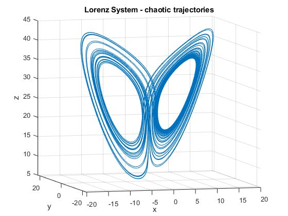
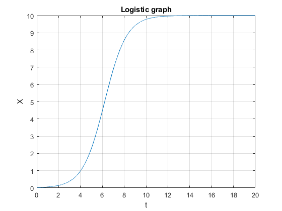
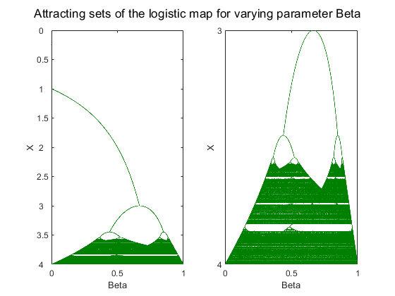

# Data-Driven-Dynamical-Systems
### Dynamical systems numerical analysis, DMD and Koopman Operator theory

Dynamical Systems:

$$
\frac{d}{dt}\mathbf{X}(t) = \mathbf{f}(x(t),t;\beta)
$$

where $x$ is the state of the system, f is the dynamics (vector fields), t is time and $\beta$ is the parameters.

#### Example : Consider Lorentz system of equations:

$$
\begin{aligned}
\dot{x}&=\sigma(y-x)\\
\dot{y}&= x(\rho-z)-y\\
\dot{z}&= y - \beta z,
\end{aligned}
$$

The system is simulated by ***simu_lorenz.m*** code. Where the parameters are set as $\sigma = 20$, $\rho = 28$ and $\beta =  8/3$. Time step is set as $\delta t = 0.004$ from $t = 0$ to $t = 60$ and initial conditions are $x(0) = 0$, $y(0) = 1$ and $z(0) = 20$.

## Discrete-time systems
Consider the Discrete-time dynamic systems:

$$
\mathbf{X}_{k+1} = \mathbf{F}(X_{k})
$$

#### Example: Logistic equation
$$
\mathbf{X}_{k+1} = \beta \mathbf{X}_{k}(1 - \mathbf{X}_{k})
$$

We can simulate the attractors based on the varrying $\beta =0:4 $ as shown in the graph below:

 
